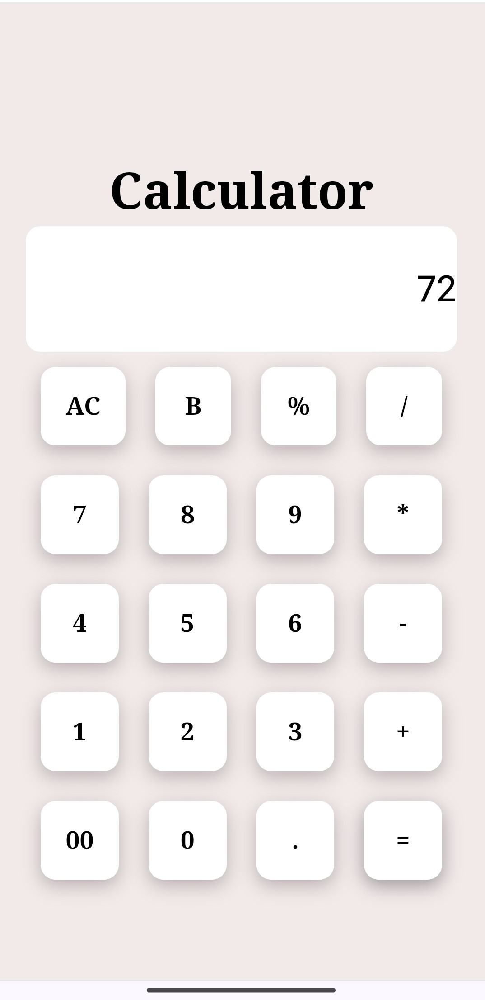

WebSite Link :- https://arun4990.github.io/Calculator/

This code sets up an event listener on each <h3> element to handle calculator operations. When an <h3> element is clicked, it updates the input field based on the clicked element's content, performing calculations, clearing the input, or modifying the input string as needed.

